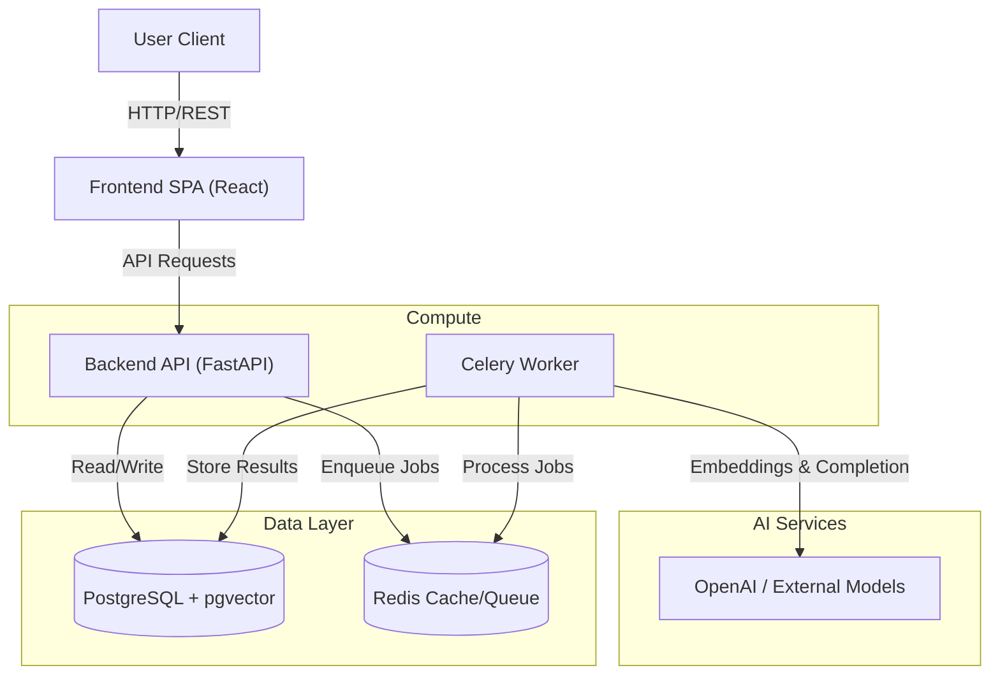

# Aura

<div align="center">


**AI-Driven Fragrance Imagery-to-Recommendation Platform**

[](https://fastapi.tiangolo.com)
[](https://reactjs.org/)
[](https://www.postgresql.org)
[](https://www.docker.com/)

</div>

---

## 📖 Introduction

**Aura** is a sophisticated fragrance recommendation engine that bridges the gap between abstract olfactory descriptions and concrete product suggestions. By leveraging **Vector Search (pgvector)** and **Large Language Models (LLMs)**, Aura interprets nuanced user queries primarily based on imagery and mood—such as *"a fresh rainy morning in a pine forest"*—and maps them to a curated database of fragrances.

Unlike traditional keyword-based search (e.g., "floral perfume"), Aura understands the *vibe*, *atmosphere*, and *emotional context* of a scent, providing highly relevant and serendipitous discoveries for users.

## 🏗 Architecture

The system is built as a modern distributed application with a clear separation of concerns between the interactive frontend, the high-performance API layer, and the asynchronous data processing pipeline.



## 🛠 Tech Stack

### Frontend
- **Framework**: [React 19](https://react.dev/)
- **Build Tool**: [Vite](https://vitejs.dev/)
- **Styling**: Custom Design System (CSS3 Variables, Glassmorphism effects)
- **Icons**: Lucide React
- **Routing**: React Router

### Backend
- **Framework**: [FastAPI](https://fastapi.tiangolo.com/) (High-performance Async Python)
- **Database**: PostgreSQL 16 with `pgvector` extension for semantic search
- **ORM**: SQLAlchemy 2.0 (Async) + Alembic for migrations
- **Task Queue**: Celery + Redis for handling long-running AI inference tasks
- **AI Integration**: OpenAI API / Custom embeddings

### DevOps
- **Containerization**: Docker & Docker Compose
- **Linting & Formatting**: Black, Isort, ESLint

## 🚀 Deployment
 
 For detailed instructions on deploying Aura securely to a production server (Linux + Docker Compose), please refer to the [Deployment Guide](DEPLOYMENT.md).
 
 **Highlights:**
 - ✅ **One-Command Bootstrap**: `./scripts/bootstrap.sh`
 - ✅ **Secure by Default**: Strict database isolation & external secrets.
 - ✅ **Maintenance**: Helpers for logs (`./scripts/logs.sh`) and updates (`./scripts/deploy.sh`).

## 💻 Local Development

If you prefer to run services individually on your machine:

### Backend
1. Navigate to `backend/`
2. Create virtual environment:
   ```bash
   python -m venv venv
   source venv/bin/activate
   ```
3. Install dependencies:
   ```bash
   pip install -r requirements.txt
   ```
4. Start Dependencies (DB/Redis) via Docker:
   ```bash
   docker compose up -d db redis
   ```
5. Run the API:
   ```bash
   uvicorn app.main:app --reload
   ```
6. Start Celery Worker (in a separate terminal):
   ```bash
   celery -A app.core.celery_app worker --loglevel=info
   ```

### Frontend
1. Navigate to `frontend/`
2. Install dependencies:
   ```bash
   npm install
   ```
3. Start Dev Server:
   ```bash
   npm run dev
   ```

## 📂 Project Structure

```
aura/
├── backend/                # FASTAPI Python Backend
│   ├── app/
│   │   ├── api/            # API Route definitions
│   │   ├── core/           # Config, Security, Celery Factory
│   │   ├── db/             # Database models & sessions
│   │   ├── models/         # Pydantic Schemas
│   │   └── services/       # Business Logic & AI integration
│   ├── migrations/         # Alembic migration scripts
│   ├── tests/              # Pytest suite
│   └── requirements.txt
├── frontend/               # React Frontend
│   ├── src/
│   │   ├── assets/         # Static assets
│   │   ├── components/     # Reusable UI components
│   │   ├── pages/          # Page views
│   │   └── hooks/          # Custom React hooks
│   └── package.json
└── docker-compose.yml      # Service orchestration
```

## 🧪 Testing

### Backend
Runs `pytest` inside the docker container to ensure isolation.
```bash
docker compose exec api pytest
```

### Frontend
Linting check:
```bash
cd frontend
npm run lint
```

## 📄 License
This project is licensed under the MIT License.
